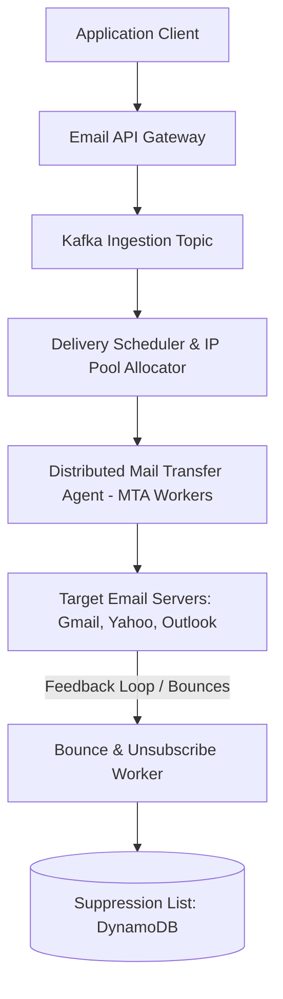

# Design a Distributed Email Delivery Service (SendGrid / AWS SES)

A petabyte-scale transactional and marketing email delivery infrastructure capable of delivering 1 Billion emails per day while maintaining high IP reputation, honoring bounce/spam feedback loops, and avoiding ISP blacklists.

---

## 1. Requirements

### Functional Requirements:
1. Send transactional emails (receipts, password resets) with sub-minute delivery.
2. Send bulk marketing campaigns (millions of recipients).
3. Handle bounces (hard vs soft), spam complaints, and unsubscribe links.
4. Domain verification via DNS records: SPF, DKIM, DMARC.

### Non-Functional Requirements:
- **High Ingestion Throughput**: Ingest 50,000 emails per second.
- **High Deliverability**: Strict IP reputation warming to prevent Gmail/Yahoo spam filtering.
- **At-Least-Once Delivery**: No transactional emails dropped.

---

## 2. Deliverability Fundamentals: SPF, DKIM, and DMARC

To prevent email spoofing and ensure delivery to user inboxes:
1. **SPF (Sender Policy Framework)**: DNS TXT record listing all IP addresses authorized to send emails on behalf of the domain.
2. **DKIM (DomainKeys Identified Mail)**: The outgoing email header is cryptographically signed with the sender's private key; the receiving ISP validates it using the public key published in DNS.
3. **DMARC**: Specifies policy (`reject`, `quarantine`) if SPF or DKIM validation fails.

---

## 3. Dedicated IP Warming and Suppression Lists

- **IP Warming**: New MTA IP addresses cannot blast 10 Million emails on day one (Gmail will instantly blackhole the IP). Traffic must ramp up gradually: Day 1: 50 emails $	o$ Day 5: 5,000 $	o$ Day 15: 500,000 $	o$ Day 30: 10 Million.
- **Suppression List**: If an email bounces as a **Hard Bounce** (invalid address) or user clicks "Spam", the address is added to an immutable suppression list. Future attempts to email this address are blocked immediately to protect domain reputation.

---

## 4. Key Takeaways

- Isolate transactional email IP pools from marketing email IP pools to protect critical 2FA delivery rates.
- Enforce cryptographic DKIM signatures and strict DMARC policies.
- Automatically drop requests to suppressed or hard-bounced email addresses.
