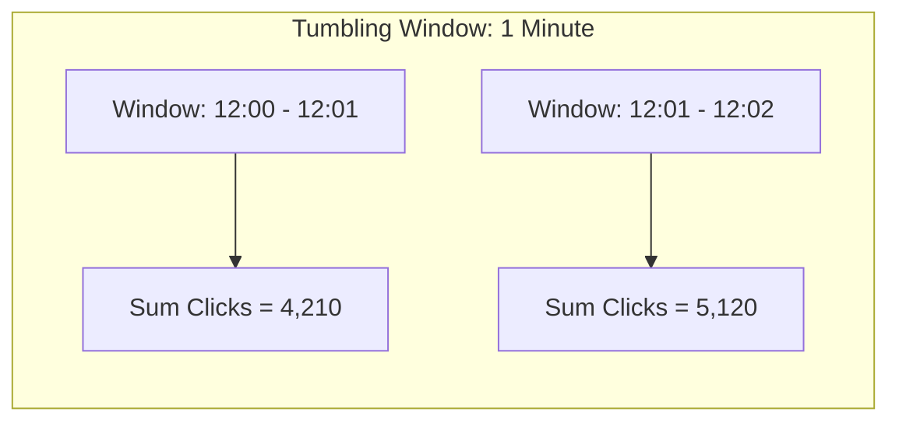

# Design a Real-Time Ad Click Aggregation System (Google Ads / Facebook Ads)

A high-throughput distributed stream aggregation pipeline capable of processing billions of ad impression and click events per day, detecting fraudulent bot clicks, and aggregating real-time advertiser billing metrics.

```mermaid
graph TD
    AdClick[User Clicks Ad] --> Edge[Click Tracking Ingress Endpoint]
    Edge --> Kafka[Kafka Raw Click Stream (Partitioned by ad_id)]
    
    Kafka --> Flink[Apache Flink Stream Processor]
    
    subgraph Stream Processing Pipeline
        Flink --> FraudEngine[Fraud Detection: Bot IP & Velocity Filtering]
        FraudEngine --> WindowAgg[Sliding Window Aggregator: 1-min & 1-hr rollups]
    end

    WindowAgg --> OLAP[(Analytical Store: ClickHouse / StarRocks)]
    WindowAgg --> BillingDB[(Advertiser Billing Ledger: PostgreSQL)]
    OLAP --> AdvertiserDashboard[Advertiser Real-Time Analytics Dashboard]
```

---

## 1. Requirements

### Functional Requirements:
1. Track ad clicks and link them to corresponding impressions.
2. Aggregate click metrics by `ad_id`, `campaign_id`, and geographic region across 1-minute and 1-hour tumbling windows.
3. Detect fraudulent clicks (e.g., bot farms, duplicate clicks within 500ms).
4. Update advertiser campaign balances in real time.

### Non-Functional Requirements:
- **Exactly-Once Processing**: Advertisers must never be double-billed for duplicate events.
- **Massive Ingestion Scale**: 100,000+ clicks/sec ($10	ext{ Billion clicks/day}$).
- **Low End-to-End Latency**: Metrics reflected in advertiser dashboard within 5 seconds.

---

## 2. Stream Processing with Apache Flink (Tumbling & Sliding Windows)



### Handling Late-Arriving Events with Watermarks:
Mobile network latency can delay click events by several minutes.
- **Watermarking**: Flink tracks event-time progress. A watermark of $T - 10	ext{s}$ tells the engine: *"Assume all events with timestamp $< T - 10	ext{s}$ have arrived; finalize the window."*
- Late events beyond the watermark trigger side-output streams to reconcile billing retroactively.

---

## 3. Fraud Detection Heuristics

1. **Duplicate Click Suppression**: Discard multiple clicks on the same ad from the same IP/Device within 1 second.
2. **Velocity Thresholds**: An IP address generating $> 50$ clicks per minute is tagged as a click farm and excluded from billing.
3. **User Agent & IP Reputation**: Cross-reference against datacenter proxy lists and headless browser signatures (Puppeteer/Selenium).

---

## 4. Key Takeaways

- Use Apache Flink for scalable event-time window aggregation with checkpointing for exactly-once guarantees.
- Ingest high-volume click streams through Kafka partitioned by `ad_id` to preserve per-ad ordering.
- Filter fraudulent and duplicate clicks prior to billing aggregations.
