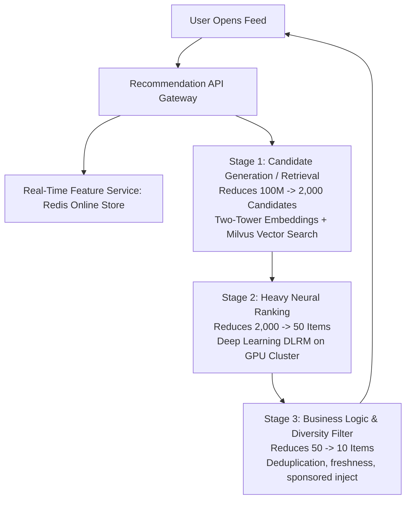
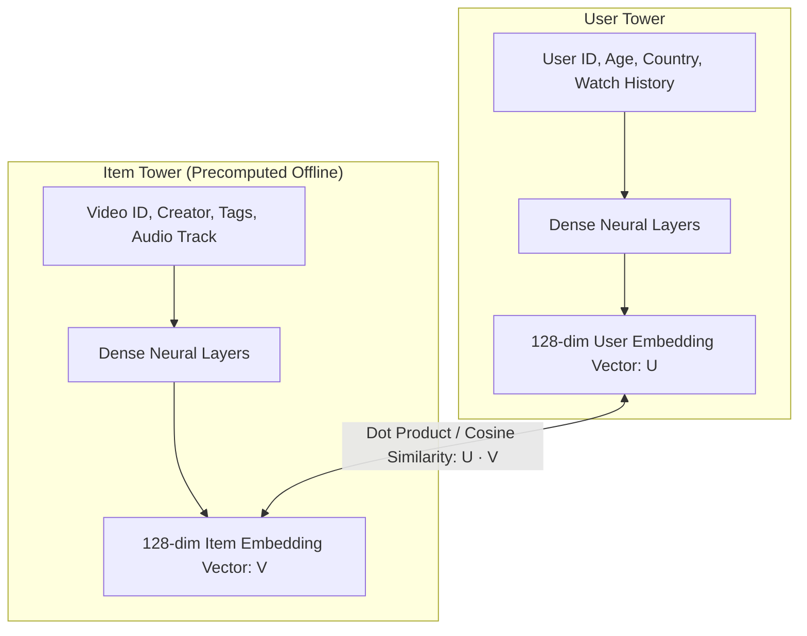

# Design a Real-Time Recommendation Engine (TikTok / Netflix)

A large-scale machine learning recommendation architecture capable of surfacing personalized video and product recommendations from a catalog of hundreds of millions of items with sub-50ms inference latency.

---

## 1. Requirements

### Functional Requirements:
1. Deliver personalized home feeds tailored to user interests and historical interactions.
2. Incorporate real-time feedback (e.g., if user skips 3 dance videos in a row, update recommendations immediately).
3. Promote diversity (do not show 10 consecutive videos from the same creator or genre).

### Non-Functional Requirements:
- **Low Latency**: End-to-end feed recommendation returned in $< 50	ext{ms}$.
- **Scale**: 500 Million DAU.
- **Freshness**: Incorporate new trending content within 15 minutes of upload.

---

## 2. The Two-Tower Neural Network Model

- **Offline Indexing**: Precompute 128-dimensional embedding vectors for all 100 Million videos and index them inside **Milvus / Qdrant** using an HNSW graph.
- **Online Query**: Compute user vector in 2ms $	o$ Execute Approximate Nearest Neighbor (ANN) search over Milvus $\implies$ Return top 2,000 candidates in **8ms**!

---

## 3. Real-Time Feature Ingestion (TikTok Secret)

Why does TikTok adapt to user preferences so rapidly?
- As user watches a video, viewing percentage (e.g., watched 100% or skipped after 2s) is streamed via WebSockets to **Apache Flink**.
- Flink updates the user's real-time interest profile inside **Redis** within 500ms.
- Next feed swipe already reflects the updated interest vector!

---

## 4. Key Takeaways

- Divide recommendation into Candidate Retrieval (Two-Tower ANN search) and Heavy Ranking (Deep Learning).
- Precompute item embeddings offline and store in vector databases (Milvus).
- Stream live interaction signals to Redis to adapt recommendations within seconds.
