# Latency and Capacity Numbers Every Engineer Should Know

System design calculations rely on knowing the orders of magnitude for computer hardware latency, bandwidth throughput, and powers of two.

```mermaid
gantt
    title Latency Comparison of Hardware Operations
    dateFormat X
    axisFormat %s

    section Fast (Nanoseconds)
    L1 Cache Reference (0.5 ns)       : 0, 1
    Branch Mispredict (3 ns)          : 0, 3
    L2 Cache Reference (7 ns)          : 0, 7
    Mutex Lock / Unlock (25 ns)        : 0, 25
    Main Memory Reference (100 ns)     : 0, 100

    section Medium (Microseconds)
    Compress 1KB with Zstd (2 us)      : 0, 2000
    Send 1KB over 10Gbps (10 us)       : 0, 10000
    Read 1MB sequentially from SSD (50 us): 0, 50000

    section Slow (Milliseconds)
    Round trip within Datacenter (0.5 ms): 0, 500000
    Read 1MB sequentially from HDD (2 ms): 0, 2000000
    Disk Seek (Rotational HDD) (10 ms) : 0, 10000000
    WAN Cross-Country (US to EU) (70 ms): 0, 70000000
```

---

## 1. Jeff Dean's Canonical Latency Numbers (Updated for NVMe)

| Operation | Latency (ns / us / ms) | Human Scale Equivalent (1ns = 1 sec) |
| :--- | :--- | :--- |
| **L1 CPU Cache Reference** | 0.5 - 1 ns | 1 second |
| **Branch Mispredict** | 3 - 5 ns | 5 seconds |
| **L2 CPU Cache Reference** | 4 - 7 ns | 7 seconds |
| **Mutex Lock / Unlock** | 25 ns | 25 seconds |
| **Main Memory (RAM) Access** | 100 ns | 1.6 minutes |
| **NVMe SSD Random Read** | 10 - 25 µs | 7 hours |
| **Read 1MB Sequentially from Memory**| 2.5 µs | 40 minutes |
| **Read 1MB Sequentially from SSD** | 50 µs | 14 hours |
| **Intra-Datacenter Round Trip** | 500 µs (0.5 ms) | 6 days |
| **Rotational HDD Seek** | 10 ms | 4 months |
| **Read 1MB Sequentially from HDD** | 20 ms | 8 months |
| **US to Europe Round-Trip (WAN)** | 70 ms | 2.2 years |
| **Global Packet Around Equator** | 130 ms | 4.1 years |

---

## 2. Capacity Powers of Two and Units

| Power of 2 | Value | Abbreviation | Common Approximation |
| :--- | :--- | :--- | :--- |
| $2^{10}$ | 1,024 | 1 KB (Kilobyte) | 1 Thousand Bytes |
| $2^{20}$ | 1,048,576 | 1 MB (Megabyte) | 1 Million Bytes |
| $2^{30}$ | 1,073,741,824 | 1 GB (Gigabyte) | 1 Billion Bytes |
| $2^{40}$ | 1,099,511,627,776 | 1 TB (Terabyte) | 1 Trillion Bytes |
| $2^{50}$ | 1,125,899,906,842,624 | 1 PB (Petabyte) | 1 Quadrillion Bytes |

### Seconds in Time Intervals:
- **1 Day** = 86,400 seconds $pprox \mathbf{10^5	ext{ seconds}}$ ($pprox 86.4	ext{K}$).
- **1 Month** $pprox 2.5 	imes 10^6	ext{ seconds}$.
- **1 Year** $pprox 3.15 	imes 10^7	ext{ seconds} pprox \mathbf{30	ext{ Million seconds}}$.

---

## 3. Server Capacity Benchmarks

- **Single Modern Web Server (4-8 Cores, Go/Rust/Node)**: 10,000 to 50,000 concurrent light HTTP requests/sec.
- **Single Redis Instance**: 100,000 to 200,000 $O(1)$ operations/sec.
- **Relational DB (PostgreSQL on NVMe)**: 5,000 to 20,000 queries/sec (read-heavy with indexes); 2,000 to 5,000 writes/sec.
- **Apache Kafka Partition**: 10MB to 30MB write throughput per second.

---

## 4. Key Takeaways

- Memory is $pprox 100	imes$ faster than NVMe SSD, and SSD is $pprox 100	imes$ faster than rotational HDD.
- Network latency across continents ($pprox 70	ext{ms}$) dwarfs compute time.
- Memorize that 1 day has $pprox 86,400$ (approx. $10^5$) seconds for fast interview QPS math.
