# The 6-Step System Design Interview Framework

A structured, predictable 45-minute blueprint for navigating senior and staff-level system design interviews.

```mermaid
gantt
    title 45-Minute System Design Interview Timeline
    dateFormat X
    axisFormat %s min

    section Step 1: Scope & Clarify
    Requirements & Constraints (5m) : 0, 5
    section Step 2: Capacity
    Back-of-Envelope Math (5m)       : 5, 10
    section Step 3: Interface
    API & Data Model (5m)            : 10, 15
    section Step 4: High-Level
    Core Architecture Diagram (10m)  : 15, 25
    section Step 5: Deep Dive
    Bottlenecks & Edge Cases (15m)   : 25, 40
    section Step 6: Wrap Up
    Failure Modes & Retrospective (5m): 40, 45
```

---

## 1. Step 1: Scope and Clarify Requirements (5 mins)
Never start drawing boxes immediately. Clarify the boundaries:
- **Functional Requirements**: Pick top 3-4 core use cases. (e.g., "1. User can post video. 2. User can view video feed. 3. User can search videos.").
- **Non-Functional Requirements**: High availability vs strong consistency, latency limits (p99 < 200ms), scalability (100M DAU).
- **Out of Scope**: Explicitly state what will NOT be built today (e.g., "Recommendation algorithms and comments are out of scope").

---

## 2. Step 2: Capacity Estimation (5 mins)
- Calculate Read and Write QPS.
- Estimate 5-year storage requirements.
- Calculate ingress/egress network bandwidth.

---

## 3. Step 3: API & Data Model Definition (5 mins)
- Define clean HTTP/gRPC endpoints with parameters.
- Sketch core database schema entities and primary keys.

---

## 4. Step 4: High-Level Architectural Design (10 mins)
- Draw end-to-end topology: Client $	o$ CDN $	o$ Load Balancer $	o$ API Gateway $	o$ Services $	o$ DB / Cache / Queues.
- Trace the primary read path and primary write path.

---

## 5. Step 5: Detailed Component Deep Dive (15 mins)
Drive the conversation into hard distributed problems:
- How does the system handle hot partitions or celebrity accounts?
- What happens if the database master fails during a write?
- Cache invalidation and stampede prevention.

---

## 6. Step 6: Failure Modes and Wrap Up (5 mins)
- Identify Single Points of Failure (SPOFs).
- Discuss metrics, alerting, monitoring, and future scale bottlenecks.
