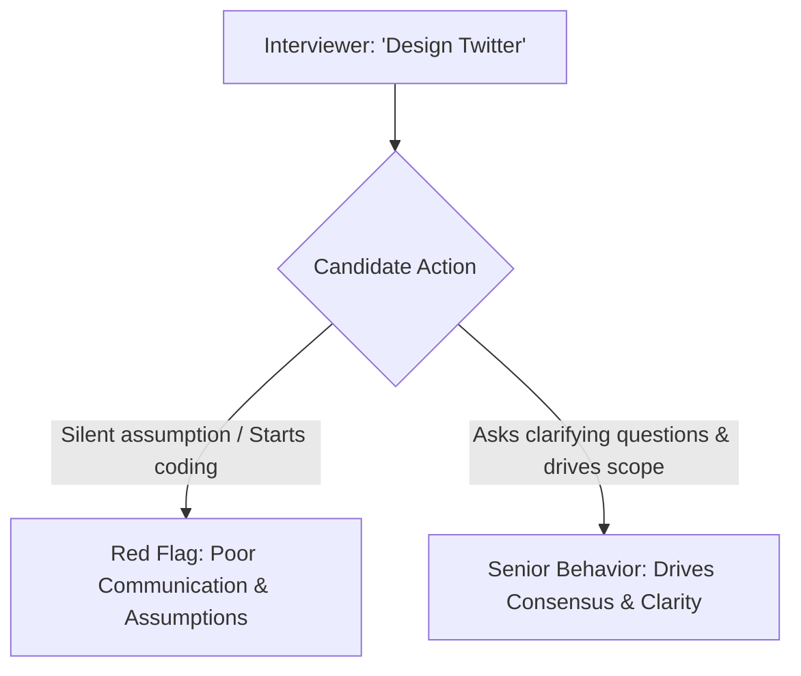

# Communication Strategies and Navigating Ambiguity

System design interviews evaluate your ability to lead, clarify vague requirements, justify technical trade-offs, and collaborate as a technical peer.

---

## 1. Driving Rather than Being Led

- **Lead the Conversation**: Treat the interview as a collaborative design meeting with a colleague. Don't wait passively for instructions.
- **State Assumptions Explicitly**: "I will assume a 100:1 read-to-write ratio typical of social networks. Does that align with your expectations?"
- **Offer Architectural Options with Trade-offs**: Never say "We must use Redis." Say: "We have two options: Memcached for pure multi-threaded throughput, or Redis for rich data structures like Sorted Sets. Given our need to rank feeds by timestamp, Redis is the superior choice."

---

## 2. Navigating Interviewer Pushback

When an interviewer interrupts with: *"What if that database node crashes?"*
1. **Acknowledge and Validate**: "Great question. If that primary node crashes..."
2. **State Immediate Impact**: "Writes to that shard will fail for ~10-30 seconds until failover completes."
3. **Propose Automated Mitigation**: "We will configure automated Raft consensus failover to promote a replica to primary and notify the API Gateway."

---

## 3. Key Takeaways

- Clarify ambiguous requirements proactively before proposing solutions.
- Frame all technology choices in terms of concrete trade-offs (pros vs cons).
- Treat the interview as a collaborative architectural whiteboard session.
