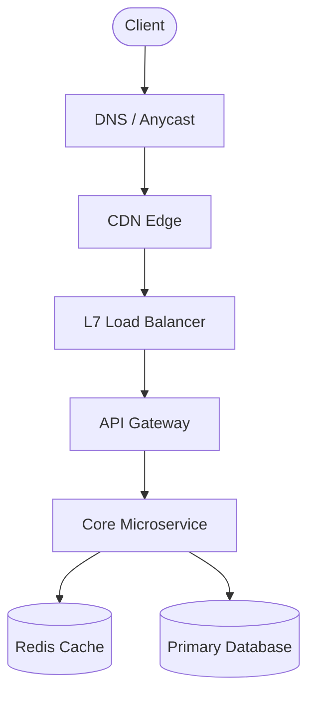

# Design <System Name>

## 1. Problem Statement
<!-- High-level executive summary of the system and user persona. -->

## 2. Requirements
### Functional Requirements
- Feature 1
- Feature 2
- Feature 3

### Non-Functional Requirements
- **Scale**: Target daily/monthly active users and request volume.
- **Latency**: P99 response time targets (e.g., < 100 ms).
- **Availability**: Target availability SLA (e.g., 99.99%).
- **Consistency**: Consistency model requirements (e.g., Eventual vs Strong).

### Out of Scope
- Non-essential features explicitly excluded to maintain design focus.

## 3. Capacity Estimation
### Traffic (QPS / RPS)
- Read QPS: ...
- Write QPS: ...
- Peak multiplier: ...

### Storage
- Data per record: ...
- Storage per day: ...
- 5-year storage retention: ...

### Bandwidth & Memory
- Ingress / Egress bandwidth: ...
- Cache memory (80/20 rule): ...

## 4. API Design
<!-- HTTP REST endpoints or gRPC service contracts with parameters and return payloads. -->

```http
POST /api/v1/resource
Content-Type: application/json
Idempotency-Key: <uuid>

{
  "key": "value"
}
```

## 5. Data Model and Storage Choice
<!-- Schema design, database selection (SQL vs NoSQL vs Columnar) with explicit reasoning. -->

| Field | Type | Description |
| :--- | :--- | :--- |
| `id` | `VARCHAR(64)` | Primary Key |
| `created_at` | `TIMESTAMP` | Record creation timestamp |

## 6. High-Level Architecture


## 7. Deep Dives
### Deep Dive 1: <Hardest Technical Challenge>
<!-- In-depth analysis of the core bottleneck or algorithm. -->

### Deep Dive 2: <Data Consistency & Concurrency>
<!-- Handling distributed transactions, locks, or race conditions. -->

## 8. Scaling Strategy
- **Caching**: Multi-tier caching strategy (edge, gateway, service).
- **Sharding**: Partition key selection and dynamic resharding.
- **Replication**: Read replicas, failover triggers, and lag management.

## 9. Reliability and Failure Scenarios
- **Single Points of Failure**: Mitigations for component outages.
- **Circuit Breakers & Retries**: Preventing cascading upstream crashes.
- **Disaster Recovery**: Multi-region failover and data recovery targets.

## 10. Security and Abuse Considerations
- Authentication, authorization (RBAC/ABAC), rate limiting, and DDoS defenses.

## 11. Monitoring and Metrics
- Key SLIs/SLOs to track (RED/USE methods) and alert thresholds.

## 12. Trade-offs and Alternatives Considered
- Option A vs Option B analysis with architectural reasoning.

## 13. Possible Extensions
- Advanced features for future engineering quarters.

## 14. Interview Follow-Up Questions
1. How does the system behave if the primary database fails during a write?
2. How would you handle a 10x traffic spike from a viral event?
3. How would you support international compliance (GDPR/data residency)?
