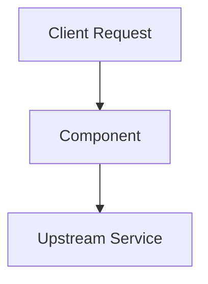

# <Topic Name>

## Overview
<!-- Define what this concept is in plain, concise English. -->

## Why It Matters
<!-- Explain the specific architectural problems this concept solves. -->

## Core Concepts
<!-- Break down the fundamental components and principles. -->

## How It Works
<!-- Step-by-step technical explanation of the internal mechanics and protocols. Include a Mermaid diagram where appropriate. -->

## Trade-offs
<!-- Comparison table evaluating trade-offs across performance, complexity, and cost. -->

| Dimension | Advantage | Disadvantage |
| :--- | :--- | :--- |
| **Performance** | High throughput | Increased latency |
| **Complexity** | Simple abstraction | Difficult debugging |
| **Cost** | Minimal compute | Higher storage overhead |

## When to Use / When NOT to Use
### When to Use
- Scenario 1
- Scenario 2

### When NOT to Use
- Anti-pattern 1
- Anti-pattern 2

## Real-World Examples
<!-- Battle-tested production implementations and corporate use cases. -->

## Common Pitfalls
<!-- Costly mistakes engineers make when deploying this pattern in production. -->

## Key Takeaways
- Takeaway 1
- Takeaway 2
- Takeaway 3

## Common Interview Questions
1. Question 1?
2. Question 2?
3. Question 3?

## Further Reading
- [Paper or Book Title](https://example.com)
- [Official Architecture Documentation](https://example.com)
